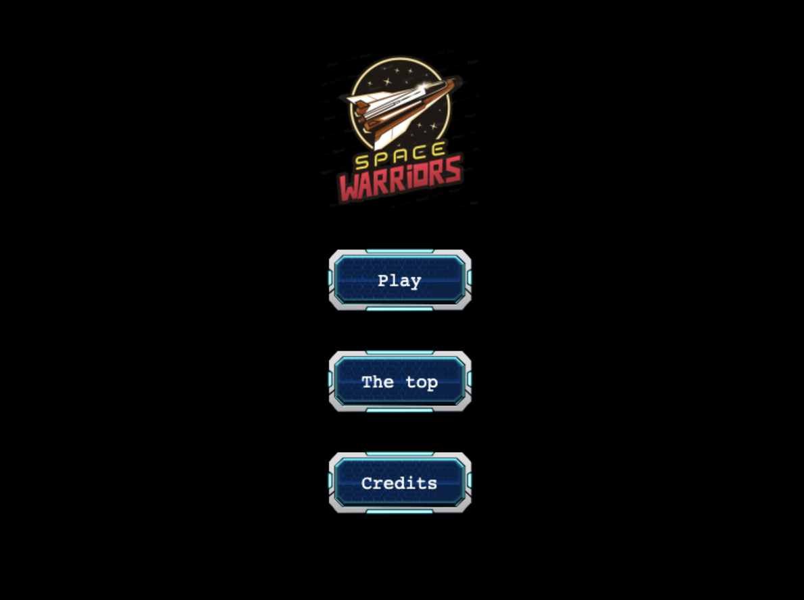
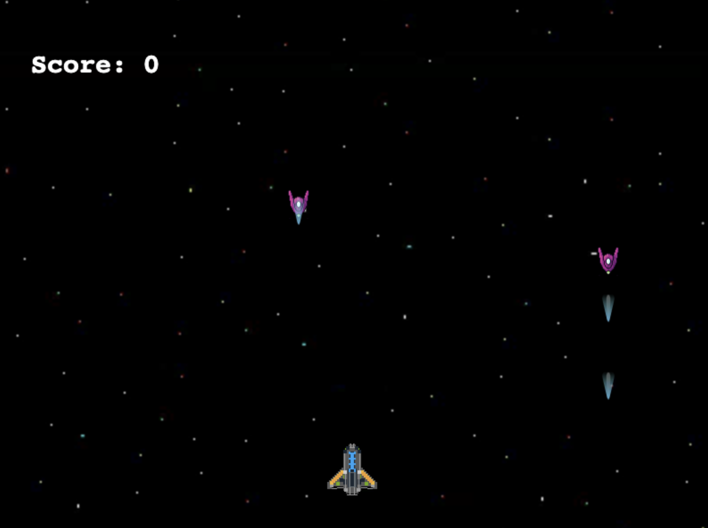

# JS Retro Shooter

> This project is inspired by the game "[ASTRO WARRIORS](https://en.wikipedia.org/wiki/Astro_Warrior/)" by SEGA. The project is a vertically scrolling shooter. Set in space, the player flies a spaceship shooting enemy spaceships to reach the mother ship of an invasion force.

## Game Design and Development Process

The design and development process was a quite challenge for me. 
1. After I collected all required assets for a project I started studying the best practices for building games using the Phaser framework. The main objectives were to decide how to organise code and modules should I have. 
2. So the main file is just starting the Boot process and adding all required scenes (in separated files). 
3. Next day I created basic templates for entities that I need (player, enemies, buttons, lasers) and what shared functionality and attributes they should have.
4. Then I focused on was how to handle the physics and motion frameworks it provides.
5. Getting all together was about building the project while keeping the following concepts in mind:
5.1. MVP - Building the main functionality before going further in implementing additional features.
5.2. I made sure that the build was deployable by enabling it to work locally and via a hosting service.
5.3. The visual aspect of the game is subject to change, I made sure I met all functionality requirements I laid out before proceeding.

## Features
- Menu navigation
- Game scene with player and enemy spaceships
- Animations on player and enemies death
- Scoring system
- Game Over scene with a form for saving scores
- API implementation of Leaderboard
- Retro style of SEGA games

## Future Features

1. Improve the UI of Menu navigation
2. Background Music and sound effects
3. Paralaxing Backgrounds
2. Add levels to the game
3. Each level should have more attacking enemies and different types of them.

## Screenshots

## Built With
- Javascript ES6
- Phaser 3 (Game Engine)
- HTML & CSS
- Webpack, npm & Babel
- Eslint & Stylelint

## Live Demo

[Check it out](cosmic-warriors.netlify.app)

## Navigation in Menu

1. The player can navigate to the following scenes after the game loads
1.1. `Credits`: This is where we give credits to the ASTRO WARRIOR and the creator of the game.
1.2. `The Top`: The scene where top 5 players are displayed.
1.3. `Play`: We navigate to the game scene.
2. A player can fire a laser to kill the enemy.
3. The enemy can also fire laser and kill the player.
3. After the game is over, the player will be navigated to `Game over` scene where he/she has the option to enter a username and press `ENTER` to `submit and save` score .

## Game Play

1. Use the ← ↑ → ↓  arrow keys to control movements of ship/player
1.1. Key Up is for moving upward
1.2. Key Down is for moving downward
1.3. Key Left is for moving backwards
1.4. Key Right is for moving fowards
2. Use the spacebar to shoot.

## Getting Started

To get a local copy up and running follow these simple example steps.

1. `git clone https://github.com/bettercallazamat/js-retro-shooter.git`
2. `cd js-retro-shooter`
3. `npm i`
4. `npm start` It will start the game in the browser automatically

### Prerequisites

- [Node.js](https://nodejs.org) is required to install dependencies and run scripts via `npm`.
- A modern browser

## Available Commands

| Command | Description |
|---------|-------------|
| `npm install` | Install project dependencies |
| `npm run start` | Build project and open web server with running project |
| `npm run build` | Builds code bundle with production settings (minification, uglification, etc..) |
| `npm run test` | Runs unit tests using Jest framework |

## Author

👤 **Azamat Nuriddinov**

- Github: [@bettercallazamat](https://github.com/bettercallazamat)
- Twitter: [@azamat_nuriddin](https://twitter.com/azamat_nuriddin)
- Linkedin: [Azamat Nuriddinov](https://www.linkedin.com/in/azamat-nuriddinov-57579868)

## 🤝 Contributing

Contributions, issues and feature requests are welcome!

Feel free to check the [issues page](https://github.com/bettercallazamat/js-retro-shooter/issues).

1. Fork it (https://github.com/bettercallazamat/js-retro-shooter/fork)
2. Create your feature branch (git checkout -b my-new-feature)
3. Commit your changes (git commit -am 'Add some feature')
4. Push to the branch (git push origin my-new-feature)
5. Create a new Pull Request

## Show your support

Give us a ⭐️ if you like this project!

## Acknowledgments
- [Microverse](https://www.microverse.org/)
- Developers at [Open Game Art](https://opengameart.org/) for the characters, sprites, lasers, etc.